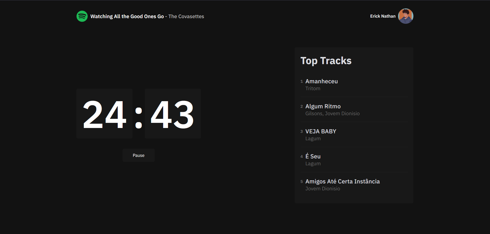

<h1 align="center">
  
</h1>

A simple tool to help focus your tasks integrated with Spotify. Inspired by [@Sophia-15/pomofy](https://github.com/Sophia-15/pomofy)
<div align="center">
  
</div>

## How to install

_To test the project it is necessary to clone it and create a developer application on spotify._

1. Create a project and get the credentials at [Spotify Developer Dashboard](https://developer.spotify.com/dashboard/)
2. Clone the repo
   ```sh
   git clone https://github.com/ericknathan/pomofy.git
   ```
3. Install NPM packages
   ```sh
   npm install
   ```
4. Enter your API Credentials in `.env`
   ```sh
    SPOTIFY_CLIENT_ID=
    SPOTIFY_CLIENT_SECRET=
    JWT_SECRET=
    NEXTAUTH_URL=http://localhost:3000
   ```
5. Run the following command to start the application in development mode
   ```sh
    npm run dev
   ```
